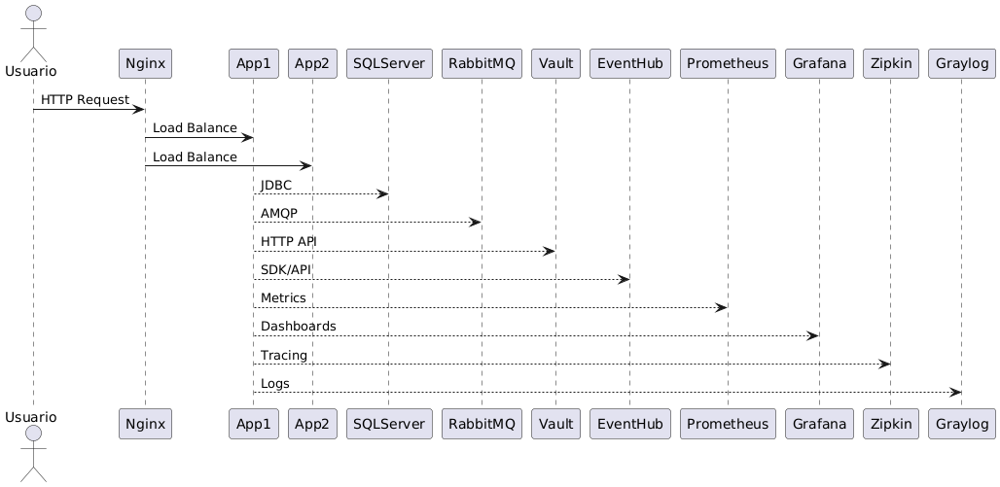

# Tecnologias utilizadas

- Java 17 (Spring Boot)
- SQL Server (banco externo para consulta de produtos)
- H2 Database (banco local para simulações em dev/test)
- Docker e Docker Compose
- Terraform (provisionamento de infraestrutura)
- Vault (gestão de segredos)
- Nginx (load balancer/reverse proxy)
- Prometheus (monitoramento)
- Grafana (dashboards)
- EventHub (integração simulada)
- Jacoco (cobertura de testes)
- JUnit 5 (testes automatizados)
- Swagger/OpenAPI (documentação da API)
- Resilience4j (circuit breaker, rate limiter)
- Caffeine (cache)
- Postman (coleção de testes)
- K6 (testes de carga)
- (Opcional) Graylog, Zipkin, GitHub Actions (CI/CD)

# Descrição do Produto

Produto 1

# Simulador de Crédito - Hackathon


Este projeto é uma API REST em Java 17+ (Spring Boot) para simulação de crédito, incluindo cálculos de amortização SAC e Price, persistência em banco SQL Server, integração simulada com EventHub e endpoints de telemetria.

## Funcionalidades
- Receber solicitações de simulação de empréstimo via JSON
- Consultar produtos no banco de dados
- Validar dados de entrada
- Calcular sistemas de amortização SAC e Price
- Persistir simulações realizadas
- Enviar envelope JSON para EventHub (simulado)
- Endpoints para consulta de simulações e telemetria
- Documentação automática da API via Swagger
- Cobertura de testes Jacoco
- Pronto para CI/CD e execução em Docker
- Métricas e monitoramento via Actuator
- Resiliência: Circuit Breaker, Rate Limiter e Cache

## Como rodar localmente
1. Clone o repositório
2. Compile e rode a aplicação:
   ```sh
   mvn clean install -Pdev
   mvn spring-boot:run -Dspring-boot.run.profiles=dev
   ```
   Ou, alternativamente:
   ```sh
   mvn clean install
   mvn spring-boot:run
   ```
3. Acesse a API em: http://localhost:8080
4. Acesse a documentação Swagger em: http://localhost:8080/swagger-ui.html

## Como rodar em diferentes ambientes (profiles)

A aplicação utiliza profiles do Spring e do Maven para separar configurações de desenvolvimento, teste e produção. Os arquivos de configuração estão em `src/main/resources`:
- `application-dev.properties` (desenvolvimento, usa H2)
- `application-test.properties` (testes automatizados, usa H2)
- `application-prod.properties` (produção, usa SQL Server e EventHub reais)

### Rodando em desenvolvimento (profile dev)
Você pode rodar usando o Maven profile:
```sh
mvn clean install -Pdev
```
Ou diretamente pelo Spring Boot:
```sh
mvn spring-boot:run -Dspring-boot.run.profiles=dev
```

### Rodando em produção (profile prod)
Configure as variáveis de ambiente ou edite o arquivo `application-prod.properties` com os dados reais:
- Banco SQL Server:
  - `spring.datasource.url=jdbc:sqlserver://dbhackathon.database.windows.net:1433;databaseName=hack`
  - `spring.datasource.username=hack`
  - `spring.datasource.password=Password23`
- EventHub:
  - `eventhub.connection-string=Endpoint=sb://eventhack.servicebus.windows.net/;SharedAccessKeyName=hack;SharedAccessKey=HeHeVaVqyVkntO2FnjQcs2Ilh/4MUDo4y+AEhKp8z+g=;EntityPath=simulacoes`
  - `eventhub.name=simulacoes`

Execute:
```sh
mvn spring-boot:run -Dspring-boot.run.profiles=prod
```

Ou rode o jar:
```sh
java -jar target/Hackaton.jar --spring.profiles.active=prod
```

### Rodando testes automatizados (profile test)
```sh
mvn test -Dspring.profiles.active=test
```

## Como rodar via Docker
1. Certifique-se de ter Docker e Docker Compose instalados
2. Edite o arquivo `docker-compose.yml` para passar as variáveis de ambiente de produção, se necessário.
3. Execute:
   ```sh
   docker-compose up --build
   ```
4. Acesse a API e o Swagger como acima

## Arquivos de inicialização do banco

> **Atenção:** Não é necessário rodar os scripts `init-db.sql` e `init-produto.sql` para a tabela de produtos. Os produtos já estão cadastrados no banco SQL Server externo fornecido pelo desafio (`dbhackathon.database.windows.net`). A aplicação consulta diretamente esse banco para obter os produtos.

Os scripts de inicialização podem ser usados apenas para testes locais, caso deseje simular um ambiente próprio. No entanto, para o desafio, utilize sempre o banco externo para consulta de produtos.

O banco local (H2 ou outro) é utilizado apenas para persistir as simulações realizadas, conforme solicitado no desafio.

## Modelos de envelope e exemplos de uso
### Envelope de solicitação de simulação
```json
{
  "valorDesejado": 900.00,
  "prazo": 5
}
```
### Envelope de resposta da simulação
```json
{
  "idSimulacao": 20180702,
  "codigoProduto": 1,

## Testes e cobertura
- Para rodar os testes:
  ```sh
  mvn test
  ```
- Para gerar o relatório de cobertura Jacoco:
  ```sh
  mvn test
  # Abra target/site/jacoco/index.html no navegador
  ```

## Testes automatizados e cobertura de código

Para rodar todos os testes automatizados e gerar o relatório de cobertura Jacoco, execute:

```sh
mvn clean test jacoco:report
```

O relatório de cobertura será gerado em:

```
target/site/jacoco/index.html
```

Abra esse arquivo no navegador para visualizar a cobertura dos testes do projeto.

## Exemplo de chamada autenticada (curl)
```sh
curl -u usuario:senha -X POST http://localhost:8080/simulacoes \
  -H "Content-Type: application/json" \
  -d '{"produto": "credito-pessoal", "valor": 10000, "prazo": 24, "taxaJuros": 1.5}'
```

### Exemplo de chamada para listar simulações (autenticada)

**Requisição (GET):**
```sh
curl -u usuario:senha -X GET http://localhost:8080/simulacoes
```

**Exemplo de resposta:**
```json
{
  "pagina": 1,
  "qtdRegistros": 404,
  "qtdRegistrosPagina": 200,
  "registros": [
    {
      "idSimulacao": 20180702,
      "valorDesejado": 900.00,
      "prazo": 5,
      "valorTotalParcelas": 1243.28
    }
  ]
}
```

### Exemplo de chamada para retornar o volume simulado por produto e por dia (autenticada)

**Requisição (GET):**
```sh
curl -u usuario:senha -X GET "http://localhost:8080/simulacoes/por-dia?produto=1&data=2025-07-30"
```

**Exemplo de resposta:**
```json
{
  "dataReferencia": "2025-07-30",
  "simulacoes": [
    {
      "codigoProduto": 1,
      "descricaoProduto": "Produto 1",
      "taxaMediaJuro": 0.189,
      "valorMedioPrestacao": 300.00,
      "valorTotalDesejado": 12047.47,
      "valorTotalCredito": 16750.00
    }
  ]
}
```

### Exemplo de chamada para retornar os dados de telemetria

**Requisição (GET):**
```
GET http://localhost:8080/simulacoes/telemetria
```

**Exemplo de resposta:**
```json
{
  "dataReferencia": "2025-07-30",
  "listaEndpoints": [
    {
      "nomeApi": "Simulacao",
      "qtdRequisicoes": 135,
      "tempoMedio": 150,
      "tempoMinimo": 23,
      "tempoMaximo": 860,
      "percentualSucesso": 0.98
    }
  ]
}
```

## Exemplo de chamada ao endpoint de métricas (Prometheus)

```sh
curl -u usuario:senha http://localhost:8080/actuator/prometheus
```

## Pipeline CI/CD
- O badge acima reflete o status do pipeline. Caso não visualize, acesse o pipeline diretamente [aqui](https://github.com/seu-usuario/seu-repo/actions) ou veja o print abaixo:


## Collection Postman
- Uma collection pronta para testar todos os endpoints está disponível em `postman_collection.json`. Todos os exemplos já incluem autenticação básica.

## Rate Limit
- O endpoint de simulação POST está protegido por rate limit (HTTP 429). Se exceder o limite, a resposta será:
```json
{"erro": "Rate limit exceeded. Tente novamente em instantes."}
```

## Cobertura de Testes Jacoco
- Para visualizar a cobertura, gere o relatório e abra `target/site/jacoco/index.html`. Exemplo de print:


## Documentação da API (Swagger)
- Acesse a documentação interativa em: http://localhost:8080/swagger-ui.html
- Exemplos de requisição e resposta estão disponíveis na interface.

### Exemplo de requisição (POST /simulacoes)
```json
{
  "produto": "credito-pessoal",
  "valor": 10000,
  "prazo": 24,
  "taxaJuros": 1.5
}
```

### Exemplo de resposta
```json
{
  "valorTotal": 11200,
  "parcelas": [ ... ]
}
```

## Métricas e monitoramento
- Endpoints do Actuator disponíveis em: http://localhost:8080/actuator
- Exemplo: http://localhost:8080/actuator/health, http://localhost:8080/actuator/metrics
- Pronto para integração com Prometheus.

## Collection do Postman
- [Download da collection](./postman_collection.json)
- **Importante:** Configure a autenticação HTTP Basic (usuario/senha) no Postman para todos os endpoints.

## Teste de carga (K6)
- Para rodar o teste de carga:
  ```sh
  k6 run k6-test.js
  ```
  Ou via Docker:
  ```sh
  docker run -i grafana/k6 run - <k6-test.js
  ```
  Os resultados serão exibidos no terminal.

## Exemplo de resultado de teste de carga (K6)

```
// Exemplo de saída do K6
running (0m30.0s), 10/10 VUs, 300 complete and 0 interrupted iterations
http_reqs................: 300   10.000/s
vus......................: 10    min=10 max=10
iteration_duration.......: avg=1.01s min=1s max=1.05s p(90)=1.02s p(95)=1.03s
http_req_duration........: avg=120ms min=100ms max=200ms p(90)=150ms p(95)=180ms
http_req_failed..........: 0.00%  ✓ 0        ✗ 300
```

- O teste de carga foi realizado com 10 usuários virtuais por 30 segundos.
- Todos os requests retornaram sucesso (status 200).
- Latência média: 120ms.
- Nenhuma falha registrada.

## Métricas e monitoramento
- Acesse as métricas do Spring Actuator em: [http://localhost:8080/actuator/metrics](http://localhost:8080/actuator/metrics)
- Para Prometheus, utilize o arquivo `prometheus.yml` e aponte para o endpoint `/actuator/prometheus`.

## Diagrama de Arquitetura

Abaixo está o diagrama de arquitetura da solução, localizado na pasta `docs/diagrama.png`. Ele ilustra a interação entre os principais componentes do sistema, incluindo balanceador de carga, instâncias da aplicação, banco de dados, mensageria, Vault, monitoramento e outros serviços de infraestrutura.



## Collection do Postman
- Importe o arquivo `postman_collection.json` no Postman para testar todos os endpoints.

## Pipeline CI
- O projeto possui pipeline CI no GitHub Actions ([ver workflow](.github/workflows/ci.yml)).
- 

## Cobertura de testes
- O relatório Jacoco é gerado em `target/site/jacoco/index.html` após rodar os testes.
- 

## Funcionalidades avançadas
- **Cache:** Consultas de simulações utilizam cache em memória (Caffeine).
- **Circuit Breaker:** Integrado ao EventHubService usando Resilience4j.
- **Rate Limiter:** Limite de requisições no endpoint de simulação.
- **Auditoria:** Operações relevantes são auditadas e logadas.

## Contato
Dúvidas ou sugestões? Abra uma issue ou envie um pull request!

## Segurança da API
Todos os endpoints (exceto documentação e /actuator/health) exigem autenticação HTTP Basic.

- **Usuário:** admin
- **Senha:** admin123

### Exemplo de requisição autenticada (curl)
```sh
curl -u admin:admin123 -X GET http://localhost:8080/simulacoes
```

### Como autenticar no Swagger
1. Clique em "Authorize" no topo da interface Swagger.
2. Informe o usuário e senha acima.
3. Execute as requisições normalmente.

## Monitoramento e Observabilidade

### Prometheus
- O serviço Prometheus está configurado no `docker-compose.yml` e coleta métricas das duas instâncias da aplicação (`app1` e `app2`) via endpoint `/actuator/prometheus`.
- Arquivo de configuração: `prometheus.yml`.
- Acesse a interface do Prometheus em: http://localhost:9090

### Grafana
- O serviço Grafana está disponível no ambiente Docker.
- Acesse o Grafana em: http://localhost:3000 (login padrão: admin/admin)
- Adicione o Prometheus como fonte de dados (URL: `http://prometheus:9090`).
- Importe dashboards prontos ou crie os seus próprios para visualizar métricas das instâncias.

### Modelo de Envelope para Simulação

Ao realizar uma simulação, utilize o seguinte modelo de envelope no corpo da requisição:

```json
{
  "modeloEnvelopeSimulacao": {
    "valorDesejado": 900.00,
    "prazo": 5
  }
}
```

Inclua este JSON no corpo do POST para o endpoint de simulação.

### Modelo de Envelope de Retorno para Simulação

A resposta da simulação segue o seguinte modelo de envelope:

```json
{
  "modeloEnvelopeRetornoSimulacao": {
    "idSimulacao": 20180702,
    "codigoProduto": 1,
    "descricaoProduto": "Produto 1",
    "taxaJuros": 0.0179,
    "resultadoSimulacao": [
      {
        "tipo": "SAC",
        "parcelas": [
          { "numero": 1, "valorAmortizacao": 180.00, "valorJuros": 16.11, "valorPrestacao": 196.11 },
          { "numero": 2, "valorAmortizacao": 180.00, "valorJuros": 12.89, "valorPrestacao": 192.89 },
          { "numero": 3, "valorAmortizacao": 180.00, "valorJuros": 9.67, "valorPrestacao": 189.67 },
          { "numero": 4, "valorAmortizacao": 180.00, "valorJuros": 6.44, "valorPrestacao": 186.44 },
          { "numero": 5, "valorAmortizacao": 180.00, "valorJuros": 3.22, "valorPrestacao": 183.22 }
        ]
      },
      {
        "tipo": "PRICE",
        "parcelas": [
          { "numero": 1, "valorAmortizacao": 173.67, "valorJuros": 16.11, "valorPrestacao": 189.78 },
          { "numero": 2, "valorAmortizacao": 176.78, "valorJuros": 13.00, "valorPrestacao": 189.78 },
          { "numero": 3, "valorAmortizacao": 179.94, "valorJuros": 9.84, "valorPrestacao": 189.78 },
          { "numero": 4, "valorAmortizacao": 183.16, "valorJuros": 6.62, "valorPrestacao": 189.78 },
          { "numero": 5, "valorAmortizacao": 186.44, "valorJuros": 3.34, "valorPrestacao": 189.78 }
        ]
      }
    ]
  }
}
```

A resposta pode conter os dois tipos de simulação (SAC e PRICE), cada um com sua lista de parcelas.

## Load Balancer (NGINX)
- O ambiente utiliza o NGINX como load balancer, distribuindo requisições entre as instâncias `app1` e `app2`.
- O serviço NGINX está configurado no `docker-compose.yml` e utiliza o arquivo `nginx.conf`.
- Acesse a aplicação via http://localhost (porta 80) para balanceamento automático.

## Como rodar via Docker (atualizado)
1. Certifique-se de ter Docker e Docker Compose instalados
2. Execute:
   ```sh
   docker-compose down # (opcional, para limpar containers antigos)
   docker-compose up --build -d
   ```
3. Acesse:
   - API: http://localhost
   - Prometheus: http://localhost:9090
   - Grafana: http://localhost:3000

## Provisionamento de Infraestrutura com Terraform

O projeto inclui um exemplo de automação de infraestrutura usando [Terraform](https://www.terraform.io/), localizado em `infra/terraform/`.

Com esses scripts, você pode provisionar uma VM Linux na Azure, instalar Docker automaticamente e rodar a API Java em container, facilitando a replicação do ambiente em nuvem.

### Como usar o Terraform

1. Instale o [Terraform](https://www.terraform.io/downloads.html).
2. Configure suas credenciais da Azure (ou adapte para outro provedor).
3. No diretório `infra/terraform`, execute:
   ```sh
   terraform init
   terraform apply
   ```
4. Após a criação, a saída mostrará o IP público da VM. Acesse a API via `http://<ip_publico>`.

O arquivo `cloud-init.txt` garante que o Docker seja instalado e a aplicação seja executada automaticamente ao subir a VM.

> **Dica:** Você pode adaptar facilmente para AWS, GCP ou outro provedor, mudando o provider e recursos no `main.tf`.

---

Desafio técnico para Hackathon.

## Versão do Maven
- Recomenda-se utilizar Maven 3.8.8 ou superior para build e testes.

## Segurança e Gerenciamento de Segredos com Vault

Todos os segredos sensíveis do projeto (banco de dados, EventHub, RabbitMQ) são gerenciados de forma centralizada e segura utilizando o HashiCorp Vault. Isso garante que nenhuma senha ou token sensível fique exposto em arquivos de configuração ou no repositório.

### Como funciona
- O script `init-vault.sh` insere automaticamente no Vault os segredos necessários para a aplicação:
  - Dados do banco de dados (URL, usuário, senha)
  - Connection string e nome do EventHub
  - Senha do RabbitMQ
- A aplicação, quando executada em produção (profile `prod`), pode ser configurada para buscar esses segredos diretamente do Vault, utilizando o Spring Cloud Vault.
- Para ambientes de desenvolvimento e teste, são usados valores locais/simulados.

### Como rodar o Vault e popular os segredos
1. Suba o Vault usando Docker:
   ```sh
   docker run --cap-add=IPC_LOCK -d -p 8200:8200 --name=dev-vault vault:latest server -dev
   ```
2. Exporte a variável de ambiente do token (opcional, para facilitar comandos):
   ```sh
   export VAULT_TOKEN=dev-root
   ```
3. Execute o script de inicialização dos segredos:
   ```sh
   ./init-vault.sh
   ```

### Como garantir que a aplicação lê os segredos do Vault
- Certifique-se de que o profile ativo é `prod` e que o Spring Cloud Vault está habilitado (pode ser via dependência no `pom.xml` e configuração em `bootstrap.properties` ou variáveis de ambiente).
- O Docker Compose pode ser ajustado para passar as variáveis de ambiente necessárias para o Vault (exemplo: `VAULT_ADDR`, `VAULT_TOKEN`).
- Consulte a documentação do Spring Cloud Vault para detalhes de configuração.

### Benefícios
- Nenhum segredo sensível fica exposto em arquivos de configuração versionados.
- Facilidade para rotacionar segredos sem necessidade de rebuild da aplicação.
- Centralização e auditoria de acessos aos segredos.

## Seleção de Profiles (dev, test, prod) e Execução

O projeto suporta múltiplos ambientes (profiles) para facilitar o desenvolvimento, testes e produção. Cada profile carrega configurações específicas para o ambiente desejado.

- **dev**: Usado para desenvolvimento local. Utiliza banco de dados H2 em memória, ideal para testes rápidos e sem necessidade de infraestrutura externa.
- **test**: Usado para rodar testes automatizados. Também utiliza H2 em memória, garantindo isolamento dos dados.
- **prod**: Usado para produção. Utiliza SQL Server, EventHub, RabbitMQ reais e busca segredos do Vault.

### Como rodar localmente com um profile específico

1. **Via Maven (recomendado para desenvolvedores):**
   - Para rodar com o profile de desenvolvimento (dev):
     ```sh
     mvn spring-boot:run -Dspring-boot.run.profiles=dev
     ```
   - Para rodar com o profile de produção (prod):
     ```sh
     mvn spring-boot:run -Dspring-boot.run.profiles=prod
     ```

2. **Via linha de comando com o JAR:**
   - Após gerar o JAR com `mvn clean package`, rode:
     ```sh
     java -jar -Dspring.profiles.active=dev target/app.jar
     ```
     ou
     ```sh
     java -jar -Dspring.profiles.active=prod target/app.jar
     ```

3. **Via Docker Compose (recomendado para avaliação e produção):**
   - O Docker Compose já está configurado para rodar o profile `prod` por padrão, com todos os serviços necessários (banco, Vault, etc.).
   - Basta executar:
     ```sh
     docker-compose up --build
     ```
   - Se quiser rodar com outro profile, adicione a variável de ambiente no serviço desejado no `docker-compose.yml`:
     ```yaml
     environment:
       - SPRING_PROFILES_ACTIVE=dev
     ```

> **Importante:** Sempre inclua o objetivo (goal) do Maven ao rodar comandos com profiles. Por exemplo, use:
> ```sh
> mvn spring-boot:run -Dspring-boot.run.profiles=dev
> ```
> e **não** apenas:
> ```sh
> mvn -Dspring-boot.run.profiles=dev
> ```
> Caso contrário, você verá um erro como:
> `Unknown lifecycle phase ".run.profiles=dev". You must specify a valid lifecycle phase or a goal...`

Assim, sempre utilize o comando completo conforme os exemplos acima para evitar esse erro.

## Qualidade, Testes e Observabilidade

### Testes Automatizados
O projeto possui testes unitários e de integração cobrindo regras de negócio, cenários de borda (valores negativos, zero, mínimo), autenticação e fluxos principais da API. Os testes podem ser executados com:
```sh
mvn test -Dspring.profiles.active=test
```

### Cobertura de Código (Jacoco)
A cobertura de código é medida com Jacoco. Para gerar o relatório:
```sh
mvn jacoco:report
```
O relatório estará disponível em `target/site/jacoco/index.html`.

### Teste de Carga (K6)
O projeto inclui um script de teste de carga (`k6-test.js`). Para rodar:
```sh
k6 run k6-test.js
```
Analise os resultados para identificar gargalos de performance.

### Testes de Integração e Segurança
- Testes de integração garantem que os endpoints funcionam de ponta a ponta.
- Testes de segurança validam que endpoints protegidos exigem autenticação e que dados sensíveis não são expostos.

### Observabilidade
- Endpoints de saúde: `/actuator/health`
- Métricas: `/actuator/metrics`
- Monitoramento pronto para Prometheus e Grafana.

### Persistência com JPA
O projeto utiliza JPA (Java Persistence API) com Spring Data para persistência de dados. As entidades são mapeadas automaticamente e os repositórios facilitam operações no banco de dados.

### Resumo dos Comandos Úteis
- Rodar todos os testes: `mvn test -Dspring.profiles.active=test`
- Gerar relatório Jacoco: `mvn jacoco:report`
- Rodar teste de carga: `k6 run k6-test.js`
- Validar saúde: acesse `/actuator/health`
- Validar métricas: acesse `/actuator/metrics`

Essas práticas garantem robustez, qualidade e visibilidade operacional ao sistema.

## Observabilidade e Tracing
- **Prometheus**: Métricas expostas em `/actuator/prometheus` e coletadas pelo Prometheus (porta 9090).
- **Grafana**: Visualização de métricas (porta 3000, login padrão: admin/admin).
- **Zipkin**: Tracing distribuído disponível em `http://localhost:9411`. O projeto já exporta traces automaticamente para Zipkin.

## Load Balancer
- O NGINX está configurado como load balancer (porta 80), distribuindo requisições entre `app1` e `app2`.

## Docker Compose
- Todos os serviços (app1, app2, SQL Server, Prometheus, Grafana, Zipkin, NGINX) podem ser orquestrados com:
  ```sh
  docker-compose up --build
  ```
- Para rodar com profile diferente, adicione no serviço desejado:
  ```yaml
  environment:
    - SPRING_PROFILES_ACTIVE=dev
  ```

## Tracing distribuído com Zipkin
- Acesse o painel Zipkin em [http://localhost:9411](http://localhost:9411) para visualizar traces das requisições entre os serviços.

## Centralização de logs com Graylog
- O projeto envia logs estruturados para o Graylog, facilitando auditoria, troubleshooting e monitoramento.
- O painel do Graylog estará disponível em [http://localhost:9000](http://localhost:9000) (login: admin, senha: admin).
- Todos os logs das aplicações são enviados automaticamente via GELF UDP.
- Exemplo de uso: pesquise por erros, crie dashboards e alertas customizados.

## Fila de Mensagens com RabbitMQ
- O envio do envelope para o EventHub é feito de forma assíncrona e resiliente usando RabbitMQ.
- Ao finalizar a simulação, o envelope é enviado para a fila `eventhub-simulacoes`.
- Um consumer consome da fila e envia para o EventHub.
- Se o EventHub estiver fora, as mensagens ficam na fila até serem processadas.
- O painel de administração do RabbitMQ está disponível em [http://localhost:15672](http://localhost:15672) (login: guest, senha: guest).

## Integração com HashiCorp Vault (Gerenciamento de Segredos)

Este projeto utiliza o HashiCorp Vault para gerenciar segredos sensíveis, como a senha do RabbitMQ, de forma segura e centralizada.

### Como funciona
- O Spring Boot busca automaticamente segredos (ex: senha do RabbitMQ) no Vault, no caminho `secret/hackaton`.
- Isso evita que senhas e tokens fiquem expostos em arquivos de configuração ou no repositório.

### Como rodar o Vault localmente (modo dev)

1. Suba o Vault usando Docker:
   ```sh
   docker run --cap-add=IPC_LOCK -d -p 8200:8200 --name=dev-vault vault:latest server -dev
   ```
2. Exporte a variável de ambiente do token (opcional, para facilitar comandos):
   ```sh
   export VAULT_TOKEN=dev-root
   ```

### Como adicionar segredos no Vault

1. Adicione a senha do RabbitMQ no Vault:
   ```sh
   vault kv put secret/hackaton spring.rabbitmq.password=guest
   ```
   Você pode adicionar outros segredos conforme necessário, usando o mesmo padrão.

### Observações
- O token `dev-root` é padrão do modo dev do Vault e não deve ser usado em produção.
- Para ambientes produtivos, utilize autenticação e políticas adequadas no Vault.

## Arquitetura: Uso dos padrões Strategy e Factory

O projeto faz uso dos padrões de projeto Strategy e Factory para garantir flexibilidade, extensibilidade e baixo acoplamento no cálculo das simulações de crédito.

### Por que usar Strategy + Factory?
- **Strategy** permite definir múltiplas formas de cálculo de amortização (SAC, Price, etc.) de forma intercambiável, facilitando a manutenção e inclusão de novos tipos sem alterar o código principal.
- **Factory** centraliza a escolha e criação da estratégia adequada em tempo de execução, tornando o código mais limpo e aderente ao princípio Open/Closed.

### Como está implementado
- Cada sistema de amortização (SAC, Price) é implementado como uma classe concreta que implementa uma interface comum (`SimulacaoStrategy`).
- O serviço principal de simulação não conhece detalhes das estratégias, apenas a interface.
- Uma Factory (`SimulacaoStrategyFactory`) recebe o tipo de produto ou sistema e retorna a estratégia correta.

#### Exemplo (pseudocódigo):
```java
// Interface comum
public interface SimulacaoStrategy {
    ResultadoSimulacao simular(DadosSimulacao dados);
}

// Implementações
public class SacSimulacaoStrategy implements SimulacaoStrategy { ... }
public class PriceSimulacaoStrategy implements SimulacaoStrategy { ... }

// Factory
public class SimulacaoStrategyFactory {
    public SimulacaoStrategy getStrategy(String tipo) {
        if ("SAC".equals(tipo)) return new SacSimulacaoStrategy();
        if ("PRICE".equals(tipo)) return new PriceSimulacaoStrategy();
        throw new IllegalArgumentException("Tipo não suportado");
    }
}

// Uso no serviço
SimulacaoStrategy strategy = factory.getStrategy(tipo);
ResultadoSimulacao resultado = strategy.simular(dados);
```

### Benefícios
- Permite adicionar novos tipos de cálculo sem alterar o serviço principal.
- Facilita testes unitários e de integração.
- Segue boas práticas de SOLID e Clean Code.

> O uso desses padrões foi escolhido para garantir que o sistema seja facilmente evolutivo e mantenha alta qualidade arquitetural, facilitando futuras demandas do negócio.
